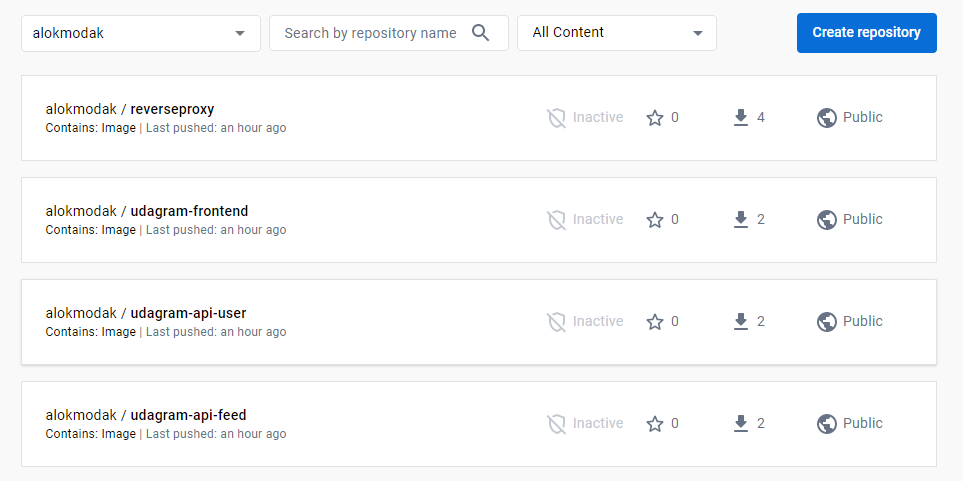
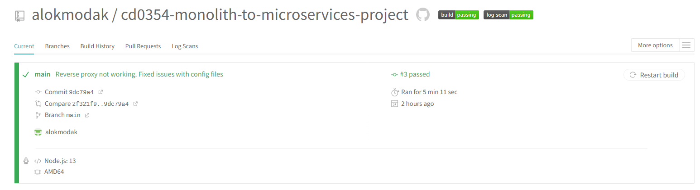
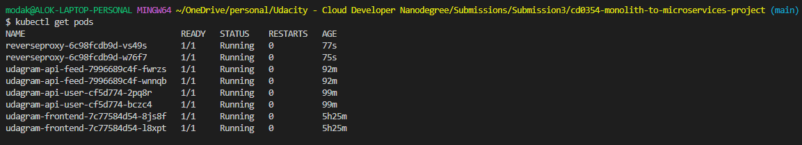

# Screenshots
To help review your infrastructure, please include the following screenshots in this directory::

## Deployment Pipeline
* DockerHub showing containers that you have pushed
  
**[Answer]**


* Travis CI showing a successful build and deploy job

**[Answer]**


## Kubernetes
* To verify Kubernetes pods are deployed properly
```bash
kubectl get pods
```

**[Answer]**

* To verify Kubernetes services are properly set up
```bash
kubectl describe services
```

**[Answer]**
*Verify the output [here](./Kubernetes_services_are_set_up_properly.txt)*

* To verify that you have horizontal scaling set against CPU usage
```bash
kubectl describe hpa
```

**[Answer]**
*Verify the output [here](./You_have_horizontal_scaling_set_against_CPU_usage.txt)*


* To verify that you have set up logging with a backend application
```bash
kubectl logs {pod_name}
```
**[Answer]**
*The logs are as follows: [api-feed](./api-feed.txt), [api-user](./api-user.txt), [front-end](./front-end.txt), [reverseproxy](./reverseproxy.txt)*
